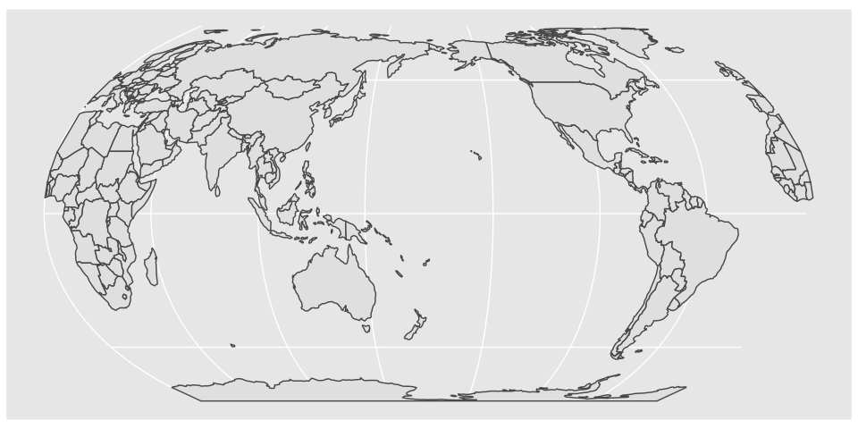
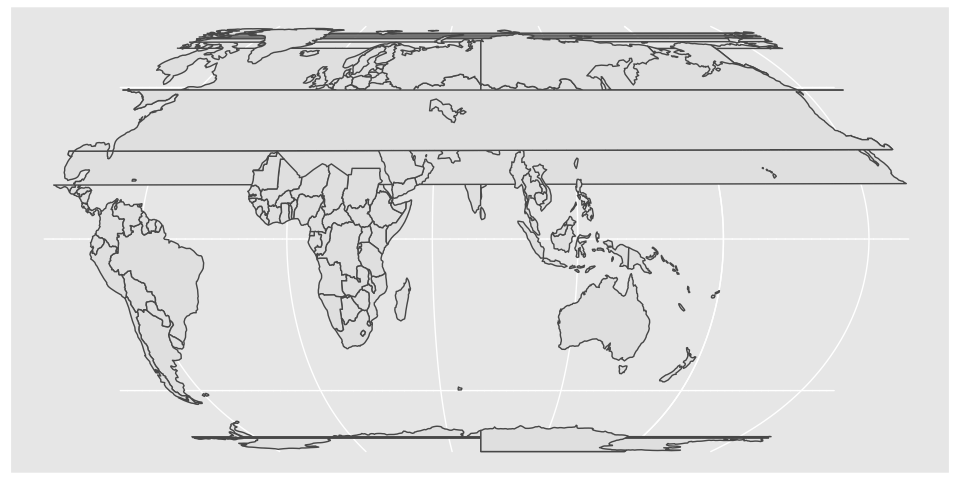
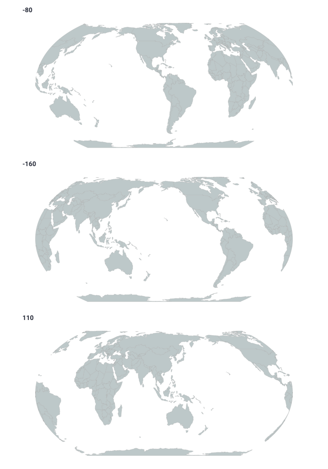
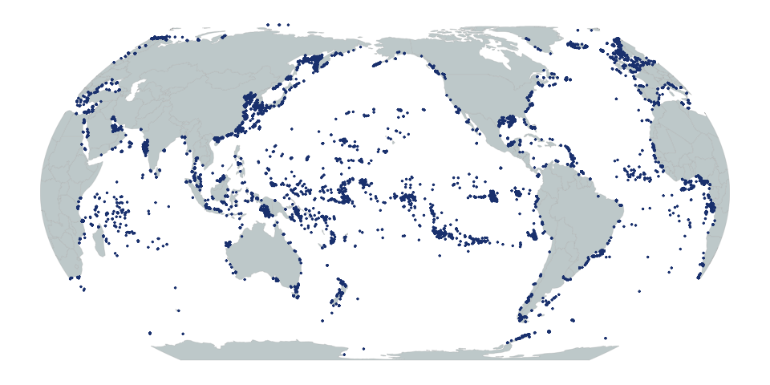
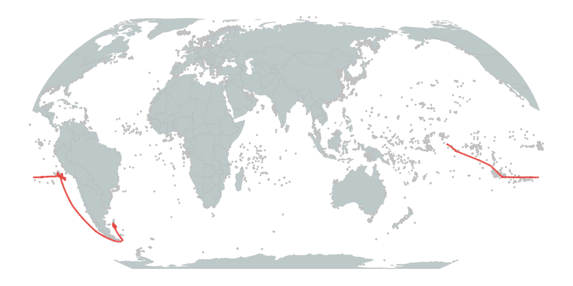
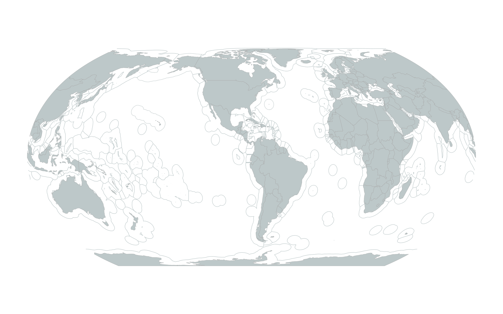
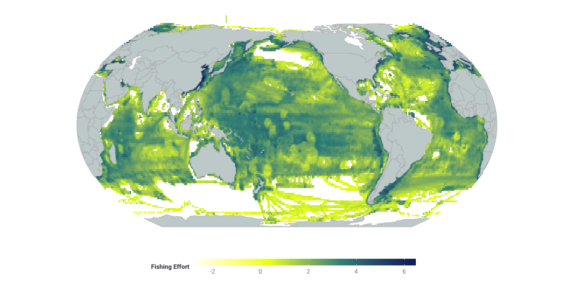
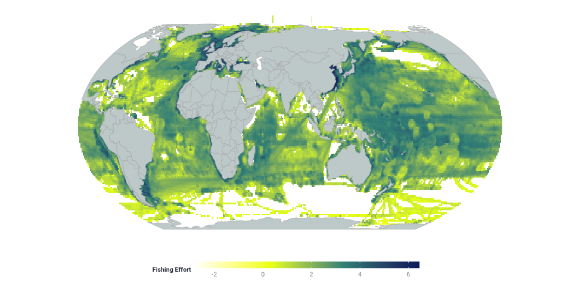

Global Map Functions
================
N. Miller
12/30/2020

``` r
library(ggplot2)
library(dplyr)
library(readr)
library(here)
library(sf)
library(magrittr)
library(rnaturalearth)
library(patchwork)
```

I have struggled for many months to determine how to recenter global
maps within R . Up until now I have used two different methods that were
unsatisfactory.

**Method 1:** Using `maptools::nowrapRecenter()` it is possible in some
cases to recenter an Atlantic centered vector file on the dateline.

``` r
land_sf <- rnaturalearth::ne_countries(scale = 110, returnclass = 'sf')
land_sf_pacfic <- sf::st_as_sf(maptools::nowrapRecenter(as(land_sf, 'Spatial')))
land_sf_pacfic_ee <- sf::st_transform(land_sf_pacfic, crs = "+proj=eqearth +lon_0=180 +wktext")
ggplot() +
  geom_sf(data = land_sf_pacfic_ee)
```

<!-- -->

Despite having an `offset` parameter it wasn’t possible to recenter an
Atlantic centered vector shapefile. It also sometimes required some
annoying back-and-forth from `sf` to `sp` to `sf` .

``` r
land_sf_pacfic <- sf::st_as_sf(maptools::nowrapRecenter(as(land_sf, 'Spatial'),offset = 80))
land_sf_pacfic_ee <- sf::st_transform(land_sf_pacfic, crs = "+proj=eqearth +lon_0=80 +wktext")
ggplot() +
  geom_sf(data = land_sf_pacfic_ee)
```

<!-- -->

**Method 2:** Using a cutting and recentering method using
`sf::st_crop()`

``` r
land_sf <- rnaturalearth::ne_countries(scale = 110, returnclass = 'sf')
x1 <- sf::st_crop(land_sf, sf::st_bbox(c(xmin = 0, xmax = 180, ymin = -90, ymax = 90)))
x2 <- sf::st_crop(land_sf, sf::st_bbox(c(xmin = -180, xmax = -0.001, ymin = -90, ymax = 90)))
land_sf_pacific <- rbind(x1, x2)
land_sf_pacific_ee <- land_sf_pacific %>%
  sf::st_transform(.,crs = "+proj=eqearth +lon_0=180 +wktext")
ggplot() +
  geom_sf(data = land_sf_pacific_ee)
```

<!-- -->

Neither of these methods was very satisfying and they both required that
the vector to be recentered on the dateline when using an
Atlantic-centered shapefile as a starting point (often the most common
starting point).

#### New Method

I finally sat down and using this gist as inspiration
<https://gist.github.com/valentinitnelav/c7598fcfc8e53658f66feea9d3bafb40>
I was able to develop a method that appears to work. It can be improved
as it uses the `sp` package in places where it could use `sf`, but its a
big step forward.

## Recentering Global Vectors (sf)

The `recenter_sf` function is designed to take an `sf` object and a
longitude on which to center the object.

1.  The function works by first adding a line segment to “cut” the `sf`
    object.


2.  The intersection of the line and the sf shape is then calculated.


3.  The line intersection is then buffered a very small amount
    (exaggerated below for the visual).


4.  The shape can then be reprojected with a new center. However, when
    large polygons are cut you end up with a line connecting the two end
    vertices. The line will not curve and the map will have straight
    edges `(see below)`.


5.  To avoid this the `recenter_sf` function adds additional vertices to
    those polygons that are cut, which results in a curved edge `(see
    below)`.


`TODO:`

1.  currently only uses Equal Earth projection

### Examples

``` r
# map theme
map_theme <- ggplot2::theme_minimal() + 
  ggplot2::theme( 
    # Chart
    panel.border = element_blank(), 
    panel.background = element_rect(fill = '#ffffff', color = NA), 
    panel.grid.major = element_line(color = '#ffffff'), 
    panel.grid.minor = element_line(color = '#ffffff'), 
    # Legend 
    legend.position = 'bottom',
    legend.box = 'vertical', legend.key.height = unit(3, 'mm'),
    legend.key.width = unit(20,'mm'), 
    legend.title.align = 0.5, 
    legend.text = element_text(family = 'Roboto', color = '#848b9b', size = 8),
    legend.title = element_text(family = 'Roboto Bold', color = '#363c4c', size = 8), 
    # Plot titles 
    plot.title = element_text(family = 'Roboto Bold', color = '#363c4c', size = 10), 
    plot.subtitle = element_text(family = 'Roboto', color = '#363c4c', size = 10), 
    # Axes
    axis.title = element_blank(), 
    axis.text = element_text(family = 'Roboto', color = '#848b9b', size = 6)
    )
```

##### Load a land vector shapefile

``` r
land_sf <- rnaturalearth::ne_countries(scale = 110, returnclass ='sf')
```

##### Load the `recenter_vector` function

``` r
source(here::here('R','recenter_vector.R'))
```

### Recenter the vector file (at -80, -160 and 110)

``` r
land_recenter_neg80 <- recenter_sf(land_sf,center = -80)
land_recenter_neg160 <- recenter_sf(land_sf,center = -160)
land_recenter_110 <- recenter_sf(land_sf,center = 110)
land_color = "#B4B4B4" 
land_fill = "#C9D2D3"

plot_neg80 <- ggplot() + 
  geom_sf( data = land_recenter_neg80, 
           color = land_color, 
           fill = land_fill, 
           size = 0.1 ) + 
  map_theme +
  labs(title = '-80')
plot_neg160 <- ggplot() + 
  geom_sf( data = land_recenter_neg160, 
           color = land_color, 
           fill = land_fill, 
           size = 0.1 ) + 
  map_theme +
  labs(title = '-160')
plot_110 <- ggplot() + 
  geom_sf( data = land_recenter_110, 
           color = land_color, 
           fill = land_fill, 
           size = 0.1 ) + 
  map_theme +
  labs(title = '110')
plot_neg80 + plot_neg160 + plot_110 + patchwork::plot_layout(ncol = 1)
```

<!-- -->

## Add Points

When points are added to a plot that has been recentered it is necessary
to recenter the points as well. However, in recentering the points they
will not need to be split in the way that a polygon must. Thus when a
`sf` POINTS object is passed into the `recenter_sf` function the points
are treated slightly differently, but are returned with the appropriate
center.

``` r
points <- readr::read_csv(here::here('data','points.csv'))
points_sf <- points %>%
  sf::st_as_sf(.,coords = c('lon_mean','lat_mean'), crs = 4326) %>%
  group_by(event) %>%
  summarize(do_union = FALSE) %>%
  sf::st_cast(.,'POINT')
```

#### Center at -160

``` r
land_recenter <- recenter_sf(land_sf,center = -160)
points_recenter <- recenter_sf(points_sf,center = -160)
```

``` r
point_color = "#204280"

ggplot() +
  geom_sf(
    data = land_recenter,
    color = land_color,
    fill = land_fill,
    size = 0.1
  ) +
  geom_sf(
    data = points_recenter,
    color = point_color,
    size = 0.5
  ) +
  map_theme
```

<!-- -->

## Add points and paths

When a LINESTRING or a path is added to a plot that has been recentered
we do need to take care to split the linestring in the same manner as we
would with a POLYGON. By splitting the linestring we can have it appear
to wrap around the globe.

However in the `recenter_sf` function a linestring is treated slightly
differently as it does not have addition vertices added to the ‘cut’
region in the way that a cut POLYGON does.

#### Center at 80

``` r
path <- readr::read_csv(here::here('data','paths.csv'))
path_sf <- path %>%
  sf::st_as_sf(.,coords = c('lon','lat')) %>%
  sf::st_set_crs(.,value = 4326) %>%
  dplyr::group_by(label) %>% 
  dplyr::summarise(do_union = FALSE) %>% 
  sf::st_cast("LINESTRING") 

path_recenter <- recenter_sf(path_sf,center = 80)
points_recenter <- recenter_sf(points_sf,center = 80)
land_recenter <- recenter_sf(land_sf,center = 80)
```

``` r
path_color = "#EE6256"
point_color = "grey80"

ggplot() +
  geom_sf(
    data = land_recenter,
    color = land_color,
    fill = land_fill,
    size = 0.1
  ) +
  geom_sf(
    data = points_recenter,
    color = point_color,
    size = 0.5
  ) +
  geom_sf(
    data = path_recenter,
    color = path_color,
    size = 1
  ) +
  map_theme
```

<!-- -->

This first iteration of the recenter\_sf function seems to work quite
well, though I am certain there are edge cases where is fails. I have
also demonstrated that is works quite perfomatively with large and
complicated shapefiles such as Exclusive Economic Zone shapes commonly
used in fisheries/marine mapping.

`Example:`



## Recentering Global Rasters (raster)

After working on `recenter_sf`, I wondered if I could modify the
approach slightly and recenter rasters as well. I generated a second
function `recenter_raster` which takes a gridded dataset as a dataframe
(not a raster), the resolution of the raster, and the new raster center
(longitude) and produces a raster dataset as a dataframe with the new
center. Once again this currently only uses an Equal Earth projection.

### Examples

##### Load the `recenter_raster` function

``` r
source(here::here('R','recenter_raster.R'))
```

#### Get raster data

Since I work at Global Fishing Watch I pulled little bit of public
fishing effort data from the public download page from here:
<https://globalfishingwatch.org/data-download/datasets/public-fisshing-effort-100:v20200316>

For ease I have only used 2016 data, aggregated to 1 degree across all
flags and geartypes.

Some methods for processing the data are described here
<https://globalfishingwatch.org/data-blog/working-with-our-downloadable-public-data-in-r/>

``` r
raster_data <- readr::read_csv(here::here('data','effort_df.csv'))
```

## Recenter land vector and raster data

### Center on -160

``` r
fishing_recenter <- recenter_raster(raster_df = raster_data, res = 1, center = -160)
land_recenter <- recenter_sf(shp_file = land_sf,center = -160)

ggplot() +
  geom_raster(data = fishing_recenter,
              aes(lon, lat, 
                  fill = log10(hours))) +
  geom_sf(data = land_recenter,
          color = land_color,
          fill = land_fill,
          size = 0.2) +
  scale_fill_gradientn('Fishing Effort',
                       colors = c("#ffffff", "#eeff00", "#3b9088", "#0c276c"), 
                       na.value = NA) +
  map_theme
```

<!-- -->

### Recenter on 80

``` r
fishing_recenter <- recenter_raster(raster_df = raster_data, res = 1, center = 80)
land_recenter <- recenter_sf(shp_file = land_sf,center = 80)

ggplot() +
  geom_raster(data = fishing_recenter,
              aes(lon, lat, 
                  fill = log10(hours))) +
  geom_sf(data = land_recenter,
          color = land_color,
          fill = land_fill,
          size = 0.2) +
  scale_fill_gradientn('Fishing Effort',
                       colors = c("#ffffff", "#eeff00", "#3b9088", "#0c276c"), 
                       na.value = NA) +
  map_theme
```

<!-- -->
